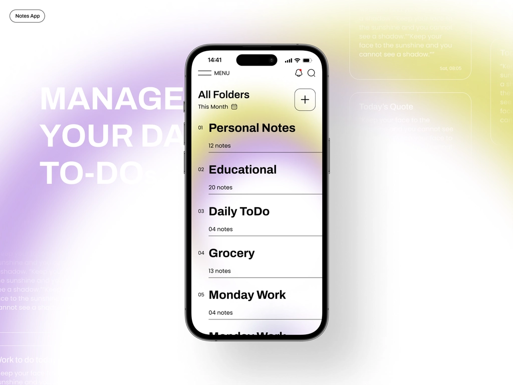

# Notes-App
Store all notes and important information digitally, usually in a cloud-based storage system
## Technology Stack
1. Ionic React
2. SCSS
3. PL/SQL
## Usage
1. Clone project repository. Here's the repository link. `git clone https://github.com/MopholosiCodes/notes-app`
2. Make sure Ionic and NPM are installed on your local machine.
2. Run npm i to install all packages.
3. Run ionic serve to start application.
## Contribution
Your contributions are welcome. Here's my suggested workflow:
1. Fork the project.
2. Make your feature addition or bug fix.
3. Send us a pull request with a description of your work.

## Demo

